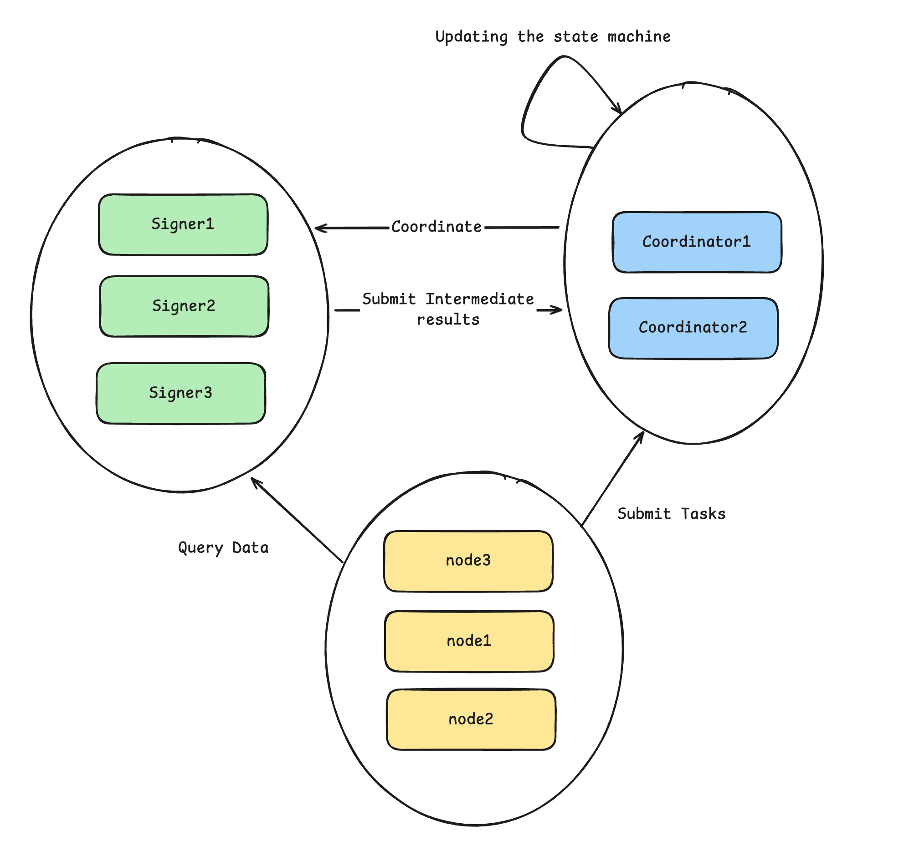
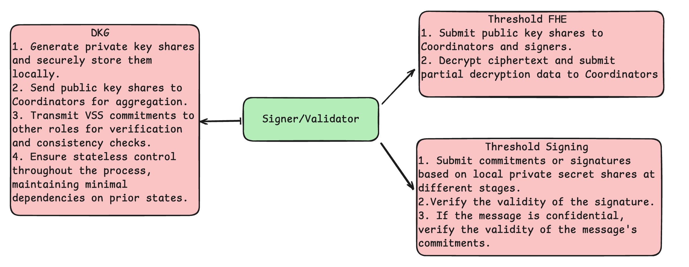
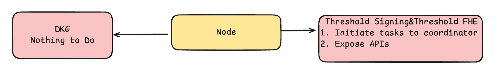
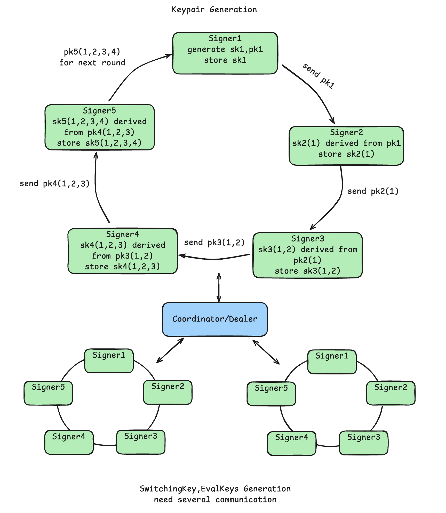
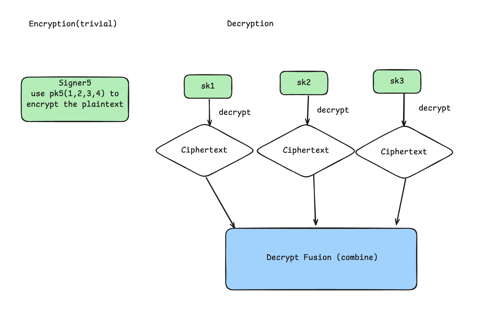
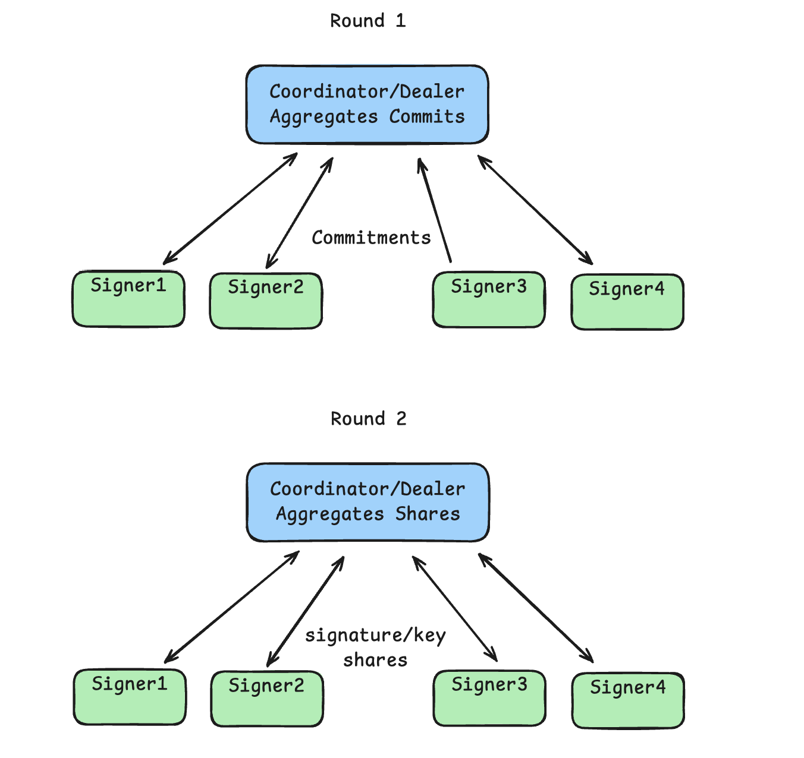

# CoFHE Threshold Secret Sharing
In CoFHE’s 2nd milestone, the focus is on implementing Threshold Secret Sharing. In the 3rd milestone, this TSS solution will be integrated into CoFHE’s Threshold Fully Homomorphic Encryption (ThFHE), enabling secure computations on encrypted data with a threshold-based encryption scheme.

Threshold Secret Sharing (TSS) is a cryptographic concept that splits a secret (e.g., a decryption key or a signature) into multiple parts, called shares, such that only a threshold number of shares are required to reconstruct the secret. The key idea behind TSS is that a secret can be divided among a group of participants, and only a predefined number (threshold) of those participants need to collaborate to access the secret. This technique offers both security and fault tolerance, as no single participant or a small group can access the full secret.

Threshold Fully Homomorphic Encryption (ThFHE)[^1] is an extension of standard Fully Homomorphic Encryption (FHE) that allows for the secret key to be split among multiple parties. In this scheme, a ciphertext can be decrypted by combining partial decryptions from a threshold number of parties, without needing to reconstruct the entire secret key. The use of a threshold ensures that a certain number of participants (not all) can collaborate to perform the decryption, enhancing both security and availability.
## Contributions
Our contributions are as follows

1. **libp2p-based Communication Protocol**: A general framework introduces a communication protocol for node identities based on libp2p, which supports authenticated channels used in secret sharing. This protocol is designed to be compatible with various cryptographic schemes, including Distributed Key Generation (DKG), Threshold Signatures (based on elliptic curves), and Threshold Fully Homomorphic Encryption (ThFHE, based on LWE/Lattice).

2. **Shamir Secret Sharing Scheme**[^1]: Shamir Secret Sharing is a cryptographic technique used to divide a secret into multiple parts, called shares. A threshold number of shares is required to reconstruct the original secret. This method ensures that the secret remains secure, as no single participant can access the full secret on their own. It is widely used in Threshold Cryptography, making it an essential component of the framework for securely distributing and reconstructing secrets.

3. **Secure Keystore Solution**: The framework provides a secure keystore solution that incorporates local encryption for key storage, effective key management, and memory safety through zeroize (ensuring keys are securely erased when no longer needed). Additionally, the key storage mechanism employs HKDF (HMAC-based Key Derivation Function) to extend keys, ensuring that even if a subkey is compromised, the root key remains secure.

4. **Threshold Secret Sharing based Signing**: Although not directly included in Polkadot’s Treasury proposal, the framework uses Shamir Secret Shcaring Scheme and it is able to integrate some common TSS framework like Frost[^2]. This protocol, which utilizes Shamir Secret Sharing for Threshold Signatures, can also serve as an implementation for Verifiable Secret Sharing Commitments (VSS Commitments). Furthermore, it provides a weaker form of Zero-Knowledge proofs, contributing to the overall cryptographic functionality of the system.

### Framework Design

#### Overview
Here we explain some terms related to the framework design:

**Session**: Also known as a task. For instance, a DKG (Distributed Key Generation) process is a session, and the process of generating a public key through secret sharing in a Threshold FHE (Fully Homomorphic Encryption) scheme is also a session. A full process involving keyswitching, particularly Threshold keyswitching, is another session, and the final decryption is a session as well. Sessions often involve multiple rounds of interaction between roles, which is managed by a state machine. This design allows multiple sessions to operate in parallel, significantly increasing computation speed.

#### Roles

- **Signer/Validator**:  
  This role mainly involves generating and storing its key share during the DKG phase and submitting the public key and VSS Commitment to the Coordinator. Signers, such as **Signer1**, **Signer2**, and **Signer3**, are shown in the image, indicating their involvement in the generation of key shares. While signers do not directly participate in state machine transitions, they record sessions for data storage and verification. They can’t drive state changes but ensure that the session data is correct for later validation.  

- **Coordinator/Dealer**:  
  Coordinators, such as **Coordinator1** and **Coordinator2**, are responsible for scheduling operations, merging computations, and handling public actions, as seen in the diagram. They coordinate the process by managing session states and ensuring the correct execution of the protocol. In the diagram, Coordinators are shown interacting with signers to collect their intermediate results. The Coordinators do not handle private data, ensuring that any malicious activity would only invalidate results rather than compromise the system.  

- **Node**:  
  Nodes represent users and can be seen in the image as **node1**, **node2**, and **node3**. In the context of FHE, nodes provide encrypted data for computation, and in Threshold signing protocols, they submit messages for signing and exchange information with other nodes. The diagram shows how nodes participate by submitting tasks and query data. Typically, two rounds of communication are required to reach the final result[^4].

The state machine plays a crucial role here. Each session may involve multiple rounds of interaction, and the state update for each interaction needs to be tracked and verified. By designing a state machine, multiple sessions can run in parallel without interfering with each other, significantly improving system efficiency.

#### Coordinator/Dealer

The Coordinator plays a pivotal role in coordinating the activities of signers and facilitating computations involving public information. Their responsibilities are as follows:

**Distributed Key Generation (DKG):**

- **Dispatch Public Key Shares and Commitments:** The Coordinator distributes public key shares and their corresponding commitments to all participants, ensuring that each participant possesses the necessary information to contribute to the key generation process.

- **Aggregate Shares and Commitments:** After receiving the shares and commitments from participants, the Coordinator aggregates them to form the collective public key, ensuring that the aggregation process maintains the security and integrity of the key.

- **Verify VSS Commitments:** The Coordinator verifies the validity of VSS commitments to ensure that the shares have been generated correctly and that the secret key can be reconstructed accurately when needed.

- **Manage the DKG State Machine of Sessions:** The Coordinator oversees the state machine for DKG sessions, ensuring that each session progresses through its stages correctly and independently, thereby enhancing the robustness of the key generation process.

- **Initiate Sessions for Signers:** The Coordinator initiates sessions for the signers, guiding them through each stage of the protocol and ensuring they perform their duties correctly. This initiation is crucial for maintaining the flow and synchronization of the key generation process.

**Threshold Fully Homomorphic Encryption (FHE):**

- **Perform Homomorphic Encryption Operations:** The Coordinator, along with other roles, can perform homomorphic encryption operations, enabling computations on encrypted data without the need for decryption. 

- **Aggregate Partial Decryptions and Perform Decryption Fusion:** Once partial decryptions are collected from participants, the Coordinator merges them to perform the final decryption operation, ensuring that the decryption process is both secure and efficient.

- **Manage the DKG State Machine of Sessions:** The Coordinator continues to oversee the state of each DKG session, ensuring that computations, such as encryption or decryption operations, follow the necessary protocol steps and maintain the integrity of the process.

- **Initiate Sessions for Signers:** Similar to the DKG process, the Coordinator initiates sessions, guiding signers through encryption or decryption procedures and ensuring that each participant contributes correctly to the overall computation.

**Threshold Signing:**

- **Aggregate Signature Shares and Commitment Shares:** The Coordinator collects signature shares and commitment shares from the signers, then aggregates them to form the final signature, ensuring that the aggregation process adheres to the threshold scheme's requirements.

- **Verify the Validity of the Signatures:** After aggregating the shares, the Coordinator ensures that the generated signature is valid, meeting the required cryptographic standards and maintaining the authenticity of the signed message.

- **Manage the DKG State Machine of Sessions:** Throughout the signing process, the Coordinator manages the state machine of each session, ensuring all steps are correctly followed and that the signing process is robust and secure.

- **Initiate Sessions for Signers:** The Coordinator initiates signing sessions, ensuring the signers collaborate effectively to generate the final signed message, thereby facilitating signing operations.

#### Signer/Validator

**Distributed Key Generation (DKG):**

- **Generate Private Key Shares and Securely Store Them Locally:** Each signer generates a private key share using a secure method, ensuring that the private key is never exposed in plaintext. These shares are stored securely to prevent unauthorized access.

- **Send Public Key Shares to Coordinators for Aggregation:** Signers transmit their public key shares to the Coordinators, who will aggregate them to form the collective public key. This process ensures that the public key is distributed across all participants, enhancing security.

- **Transmit VSS Commitments to Coordinators:** Signers send their VSS commitments to other participants, allowing them to verify the integrity and consistency of the shares. This step is crucial for ensuring that all shares are correctly generated and that the secret key can be reconstructed accurately when needed.

- **Stateless Control:** Signers operate in a stateless manner, ensuring that each operation is independent and does not rely on previous states. This approach enhances the robustness and scalability of the system.

**Threshold Fully Homomorphic Encryption (FHE):**

- **Submit Public Key Shares to Coordinators and Signers:** Signers provide their public key shares to both Coordinators and other signers, facilitating the collaborative generation of the public key. This collaborative approach enhances the security and trustworthiness of the public key.

- **Decrypt Ciphertext and Submit Partial Decryption Data to Coordinators:** Signers perform decryption operations on ciphertexts and submit their partial decryption results to the Coordinators. The Coordinators then aggregate these partial decryptions to obtain the final plaintext, ensuring that no single participant has access to the complete plaintext, thereby preserving privacy.

**Threshold Signing:**

- **Submit Commitments/Signatures Shares** Signers generate commitments or partial signatures using their private key shares at various stages of the signing process. These partial signatures are then combined to form the final signature.

- **Signature Verification** Signers participate in the verification process to ensure that the final signature is valid and meets the required cryptographic standards. This step is essential for maintaining the integrity and authenticity of the signed message.

- **Message Commitments Verification** In scenarios where the message content is confidential, signers verify the validity of the message's commitments to ensure that the message has not been tampered with and that it originates from a legitimate source.

#### Node

- **Task Initiation:** As a user or participant in the system, the node submits data or requests for processing. In encryption protocols, the node provides encrypted data for computation; in signing protocols, the node submits messages to be signed along with the specified public keys. These requests typically initiate corresponding sessions through communication with the Coordinators.

- **Interface Exposure:** The node offers public APIs or services that allow external systems or users to query processing results, such as decrypted data, signature validity, or other relevant information. This not only enhances the system's transparency but also improves interoperability with external systems.

### Threshold FHE Framework

The Threshold FHE communication framework is designed with simplicity and reliability in mind. During the DKG phase, the coordinator orchestrates the process by distributing different keys to the signers, establishing multiple circular communications between them. This setup ensures that there is no direct communication between signers, preventing a situation where an interruption from a single signer could cause issues with the process in subsequent rounds. All communication is handled centrally by the coordinator, which helps maintain the integrity of the system.

Since Threshold FHE involves the use of multiple keys, multiple such circular communication steps are required throughout the system, as illustrated in the diagrams.

In the DKG phase (as shown in the first diagram), the coordinator helps signers generate and derive their keys. Each signer generates their private key share (`sk`) and corresponding public key share (`pk`) at different stages. The process involves sending these key shares to other signers and the coordinator, which is crucial for ensuring that each signer is aware of the overall key generation status. This key exchange is essential for enabling secure decryption and encryption steps later in the process.

Once the keys are generated, the encryption and decryption phases follow. During the encryption phase, Signer5 uses their key share (`pk5`) to encrypt the plaintext. The ciphertexts are then passed around, with each signer performing decryption on their assigned ciphertext using their corresponding private keys (`sk1`, `sk2`, `sk3`). Each signer then sends their partial decryption back to the coordinator, who performs decryption fusion (as shown in the second diagram). The coordinator combines these partial decryptions to reconstruct the final plaintext.

In this way, the system ensures that all participants are involved in the decryption process, without exposing the entire decryption operation to any single party. By relying on the coordinator to fuse the partial decryptions, this method avoids the risks associated with direct signer-to-signer communication, providing an efficient and secure way to handle encrypted data in a distributed manner.

### Threshold Signing Framework

Threshold Signing is more complex, typically requiring two rounds of communication to complete both the DKG and signing process.

- **Round 1:** In this round, the signers submit their commitments or provide pre-processed commitments. Commitments are cryptographic assurances that the signer will provide a valid signature in the next step. 
- **Round 2:** In the second round, the signers generate their key shares or signature shares, which are then aggregated by the coordinator. The coordinator ensures that the final signature or key shares are valid and consistent.

This two-round process ensures that no single signer has access to the complete signature or key share at any time, maintaining the privacy and integrity of the process. By relying on the coordinator to aggregate the shares, the system ensures security while also enabling parallelization of the operations.

The Threshold Signing Framework involves a combination of key management and signing protocols to ensure that signatures are only generated when a threshold number of participants collaborate, which provides additional security over traditional single-signature methods. The aggregation of shares by the coordinator ensures that the final result is a valid signature, while individual signers only contribute a partial share. 

### Communication and Security

**Communication:** We utilize libp2p for communication, ensuring that each role has corresponding authentication mechanisms. A generalized state machine is implemented to transition to the appropriate state based on different response statuses.

**Security:** The code does not expose any private key information. Specifically, data in the keystore is processed using `Zeroize` to prevent unintentional leakage. Root keys are derived to ensure they are not lost. Communication between different roles includes corresponding identity verification to maintain security.

### Code Analysis

The project comprises several submodules:

- `common` Module: Contains general-purpose logging, configuration, and utility libraries.

- `coordinator-signer` Module
   - Implements general behaviors for the `coordinator`.
   - Implements general behaviors for the `signer`.
   - Implements general behaviors for the `node`.
   - Provides functionalities for `session` and `subsession`.
   - Includes `keystore` storage, capable of managing derived keys.
   - Encompasses functionalities like `dkg` and `tss`.
- `tss` &`tss_sdk` Module: Encapsulation and interface exposure

- The entire framework is built on the asynchronous Tokio runtime, allowing sessions to run concurrently.

- It implements necessary identity authentication for integrating with Substrate and adapts libp2p's authentication mechanisms.

Although the implementation is complete, we have not yet exposed the encryption and decryption interfaces for Fully Homomorphic Encryption (FHE). This is because, during the computation process of FHE's multiparty schemes, especially Threshold FHE, aborts (i.e., default keys) can occur. In such cases, performing key switching may lead to issues like key storage problems. The FHE implementation is primarily in the third milestone and will be made available [here](https://github.com/Co-FHE/fhe-core). At that time, we plan to integrate Threshold Signing (TSS) into `fhe-core` to provide complete interfaces. The second milestone focuses mainly on the Secret Sharing framework. Since this is a general-purpose framework, all network communications and authentications are independent of the scheme. Additionally, our Threshold FHE has implemented some operators and encapsulated necessary interfaces for Threshold, as referenced [here](https://github.com/Co-FHE/fhe-core/blob/main/README.md). 

## Adaptation for the Substrate Framework

This section outlines the integration of a Threshold Secret Sharing (TSS) solution into the Substrate framework. The design supports two identity verification approaches to securely manage and distribute secret shares among participants:

- **Substrate’s sr25519-based scheme:** Leverages Substrate’s native cryptographic primitives.
- **libp2p’s identity scheme:** Utilizes libp2p’s peer-to-peer identity system.

By providing a unified set of interfaces, this design ensures that secret sharing operations can seamlessly interact with different identity verification mechanisms in a consistent manner.

###  Unified Interface Design

The core design relies on a set of unified traits to abstract identity operations needed in a threshold secret sharing system:

- **ValidatorIdentity:** Defines the basic types, including the keypair, public key, and identity.
- **ValidatorIdentityKeypair:** Encapsulates operations such as retrieving the public key, signing messages, key derivation, and random keypair generation.
- **ValidatorIdentityIdentity:** Manages identity conversion functions, such as constructing an identity from a public key and converting between string and byte representations.
- **ValidatorIdentityPublicKey:** Provides methods for creating public keys from keypairs and verifying signatures.

This abstraction allows both the sr25519 and libp2p implementations to be plugged into the TSS system without changing the core logic, thereby simplifying maintenance and future expansion.

### Substrate’s sr25519 Identity Verification Scheme
The sr25519-based identity solution is implemented in the `sr25519_identity.rs` file, with key design points including:

- **Types and Keypairs:**  
  - Uses `sp_core::sr25519::Pair` and `sp_core::sr25519::Public` as the underlying types for keypairs and public keys.
  - Defines the identity as an `AccountId32`, a standard type in Substrate that maps directly to on-chain accounts.

- **Signing and Key Derivation:**  
  - Implements the `ValidatorIdentityKeypair` trait by invoking the `sign` method on the sr25519 `Pair` to generate signatures.
  - Key derivation is achieved by combining a hard-derived junction (via `DeriveJunction::hard(1)`) with a SHA256 digest of the provided salt, thus offering a flexible way to derive keys.

- **Identity and Public Key Conversion:**  
  - Converts sr25519 public keys into `AccountId32` identities using the `from_public_key` method.
  - Supports bidirectional conversions between identity representations (strings and byte arrays) with methods such as `to_fmt_string`, `from_fmt_str`, `to_bytes`, and `from_bytes`. 

The sr25519 scheme is ideal for on-chain operations within the Substrate ecosystem, where high security in managing and distributing secret shares is critical.

### libp2p Identity Verification Scheme

The libp2p identity solution is implemented in the `p2p_identity.rs` file, featuring the following design highlights:

- **Types and Keypairs:**  
  - Utilizes `libp2p::identity::Keypair` and `libp2p::identity::PublicKey` for cryptographic operations.
  - Uses `libp2p::identity::PeerId` as the identity marker, which is fundamental for uniquely identifying nodes in a P2P network. 

- **Signing and Key Derivation:**  
  - Implements the `ValidatorIdentityKeypair` trait by using the libp2p `Keypair::sign` method to sign messages.
  - Provides key derivation via the `derive_secret` method, using a salt to generate derived key material.
  - The scheme is built upon ed25519-based keys, ensuring a high level of security for distributed secret sharing.

- **Identity and Public Key Conversion:**  
  - The `ValidatorIdentityIdentity` trait handles conversion between public keys and `PeerId`, supporting Base58 string formatting and byte array representations.
  - The `ValidatorIdentityPublicKey` trait supports extracting public keys from keypairs and verifying digital signatures, ensuring reliable identity verification. 

The libp2p scheme is particularly well-suited for P2P communications, distributed systems, and cross-chain secret sharing gateways, where efficient identity verification is essential.

## Acknowledgements
We would like to extend our sincere gratitude to Polkadot for their support, as well as to the Verisense team for their invaluable contributions.

## Reference
[^1]: Boneh, D., Gennaro, R., Goldfeder, S., Jain, A., Kim, S., Rasmussen, P. M. R., & Sahai, A. (2018). Threshold Cryptosystems from Threshold Fully Homomorphic Encryption. Advances in Cryptology – CRYPTO 2018, 565–596. doi:10.1007/978-3-319-96884-1_19 
[^2]: Komlo, C., Goldberg, I. (2021). FROST: Flexible Round-Optimized Schnorr Threshold Signatures. In: Dunkelman, O., Jacobson, Jr., M.J., O'Flynn, C. (eds) Selected Areas in Cryptography. SAC 2020. Lecture Notes in Computer Science(), vol 12804. Springer, Cham. https://doi.org/10.1007/978-3-030-81652-0_2
[^3]: A general framework introduces a communication protocol for node identities based on libp2p, which supports authenticated channels used in secret sharing. This protocol is designed to be compatible with various cryptographic schemes, including Distributed Key Generation (DKG), Threshold Signatures (based on elliptic curves), and Threshold Fully Homomorphic Encryption (ThFHE, based on LWE/Lattice).
[^4]: Asharov, G., Jain, A., López-Alt, A., Tromer, E., Vaikuntanathan, V., Wichs, D. (2012). Multiparty Computation with Low Communication, Computation and Interaction via Threshold FHE. In: Pointcheval, D., Johansson, T. (eds) Advances in Cryptology – EUROCRYPT 2012. EUROCRYPT 2012. Lecture Notes in Computer Science, vol 7237. Springer, Berlin, Heidelberg. https://doi.org/10.1007/978-3-642-29011-4_29